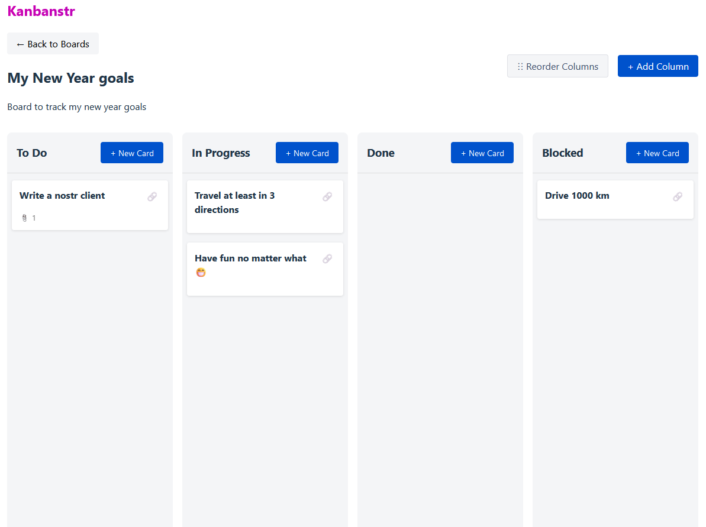

# Kanbanstr

WIP Repo for Kanban board implementation over nostr.

# Features

* Login using nsec, npub, NIP-07 - Done
* Create Boards with multiple columns - Done
* Create cards in boards - Done
* Add/Delete/reorder columns in boards - Done
* Markdown description in cards - Done
* Cards automapped to columns using 
    * EXACT status = column name - Done
    * Programmatic - Yet to do
* Cards assigned to people using 'zap' tags - Done (This is for people to get paid when the card is zapped)
* Zap cards - Yet to do

